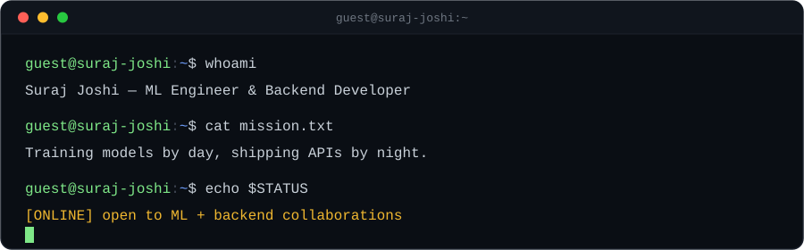

<div align="center">



<br/><br/>

<a href="https://www.linkedin.com/in/suraj004"></a>
<a href="https://github.com/Surajjoshi2004"></a>
<a href="https://github.com/Surajjoshi2004"></a>

</div>

<br/>

<pre align="center">
────────────────────────────────────────────────────────────
</pre>

## `❯ whoami`

```python
suraj = {
    "name"       : "Suraj Joshi",
    "role"       : ["ML Engineer", "Backend Developer"],
    "location"   : "LPU, India 🇮🇳",
    "focus"      : "Building end-to-end intelligent systems",
    "learning"   : ["ML Pipelines", "REST APIs", "Model Deployment"],
    "interests"  : ["Machine Learning", "API Design", "Data-Driven Apps"],
    "open_to"    : "ML + Backend collaborations 🤝",
}
```

<pre align="center">
────────────────────────────────────────────────────────────
</pre>

## `❯ ls tech-stack/`

**`ml-and-data/`**
<br/>


**`mern-stack/`**
<br/>


**`languages-and-apis/`**
<br/>


**`databases-and-devops/`**
<br/>


<pre align="center">
────────────────────────────────────────────────────────────
</pre>

## `❯ ./run_diagnostics.sh --stats`

<div align="center">


<br/>


</div>

<pre align="center">
────────────────────────────────────────────────────────────
</pre>

## `❯ git log --author leetcode`

<div align="center">

</div>

<pre align="center">
────────────────────────────────────────────────────────────
</pre>

## `❯ cat currently.md`

```
❯ building     ML-powered backend APIs that make it to production
❯ exploring    model deployment, MLOps, and distributed systems
❯ prototyping  LLM-integrated real-world applications
❯ open to      questions on Python, ML, or system design
```

<pre align="center">
────────────────────────────────────────────────────────────
</pre>

## `❯ ls achievements/`

<div align="center">

</div>

<pre align="center">
────────────────────────────────────────────────────────────
</pre>

## `❯ git log --graph --contributions`

<div align="center">

</div>

### Contribution Tetris
<div align="center">

</div>

<pre align="center">
────────────────────────────────────────────────────────────
</pre>

## `❯ ./contact.sh`

<div align="center">

> `"The best way to predict the future is to build it."`

<a href="https://www.linkedin.com/in/suraj004"></a>
<a href="https://github.com/Surajjoshi2004"></a>

</div>

<br/>

<div align="center">
<sub>guest@suraj-joshi:~$ <span>_</span></sub>
</div>
